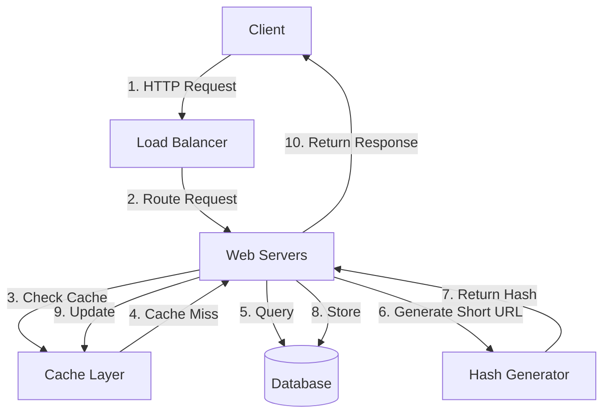
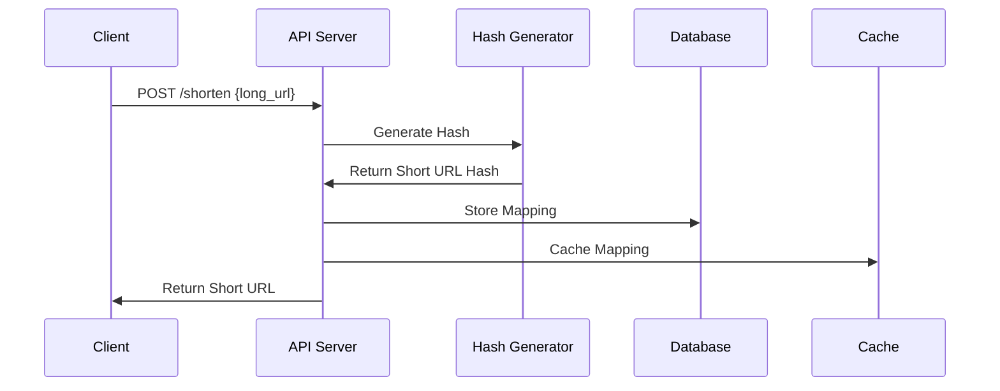
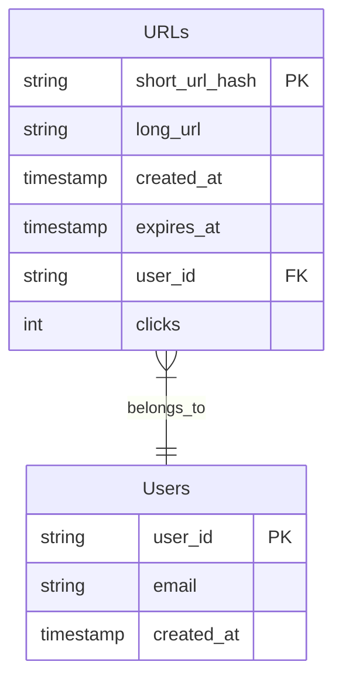
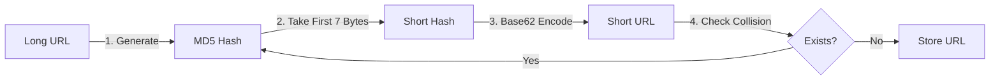
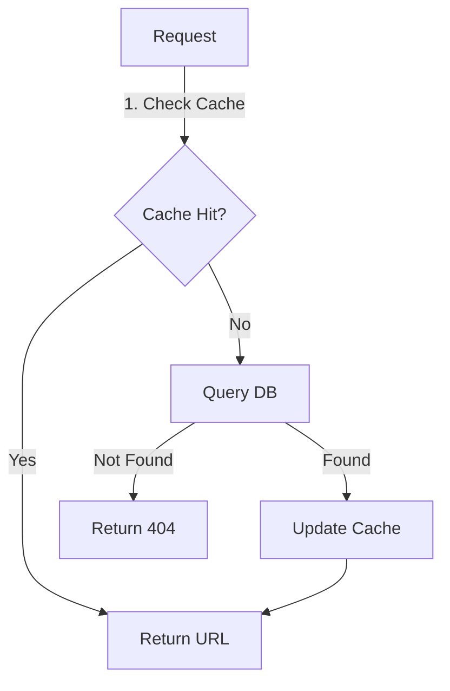
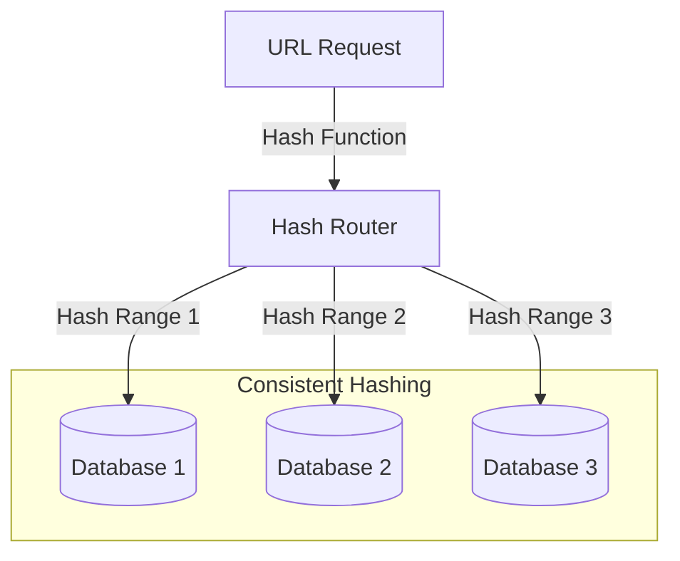
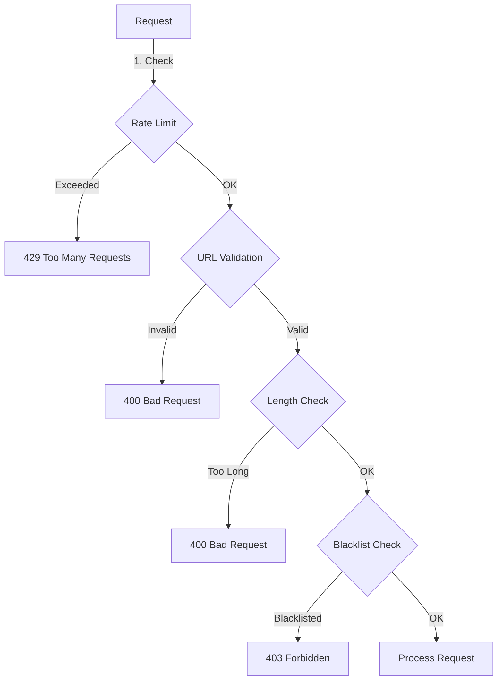

# System Design: URL Shortener (TinyURL)

## 1. Problem Statement and Requirements

Let's start by defining what we need to build.

### Functional Requirements
- Generate a short URL from a given long URL
- Redirect users to the original URL when they access the short URL
- Optional custom short URLs
- URL expiration (optional)

### Non-Functional Requirements
- High availability
- Low latency for redirections
- URL shortening should be real-time
- Short URLs should be unique and hard to predict



## 2. Back-of-the-envelope Calculations

### Traffic Estimates
- Assuming 100 million URLs generated per month
- Read:Write ratio = 100:1
- QPS (Queries Per Second):
  - URL Creation: ~40 URLs/sec
  - URL Redirection: ~4,000 URLs/sec

### Storage Estimates
- Long URL average size: 100 bytes
- Short URL size: 7 bytes
- Metadata (timestamp, user_id, etc.): 50 bytes
- Total size per entry: ~160 bytes
- Storage needed for 5 years: 100M * 12 * 5 * 160 bytes ≈ 960GB



## 3. API Design

### REST API Endpoints

```plaintext
1. Create URL
POST /api/v1/shorten
Request: {"longUrl": "https://example.com", "customAlias": "myurl"}
Response: {"shortUrl": "http://tiny.url/abc123"}

2. Redirect URL
GET /:shortUrl
Response: HTTP 301 Redirect

3. URL Statistics (Optional)
GET /api/v1/stats/:shortUrl
Response: {"clicks": 100, "created": "2024-01-01"}
```

## 4. Database Design



## 5. URL Shortening Algorithm



## 6. Detailed Component Design

### Cache Architecture
- Use Redis for caching
- Cache the most frequently accessed URLs
- LRU eviction policy
- Cache size: 20% of daily active URLs



## 7. Scale and Optimization

### Data Partitioning



## 8. Security and Rate Limiting

To prevent abuse, implement:
1. Rate limiting per IP/user
2. URL validation
3. Length restrictions
4. Blacklist functionality



## 9. Monitoring and Analytics

Key metrics to monitor:
- Redirection latency
- Cache hit ratio
- Error rates
- Storage usage
- QPS by endpoint

## 10. Alternative Approaches

1. **UUID-based**: Generate UUID instead of hash
2. **Counter-based**: Use an auto-incrementing counter
3. **Base62 of timestamp + random string**

Each approach has its trade-offs in terms of:
- URL length
- Collision probability
- Predictability
- Database load
