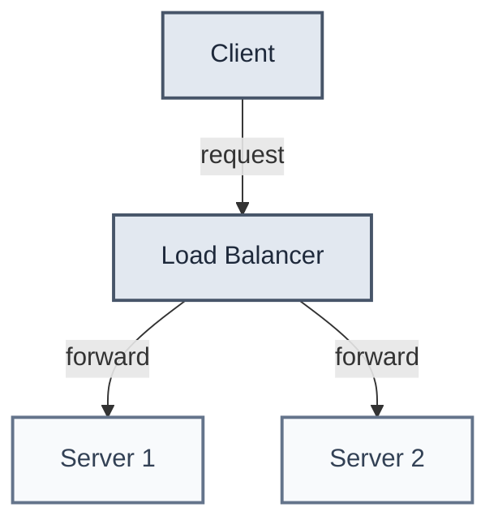
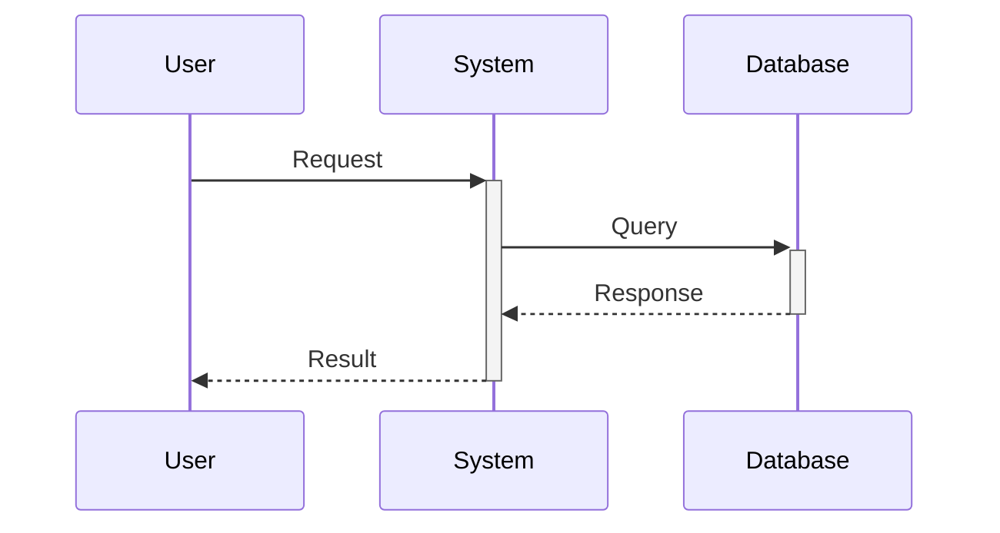
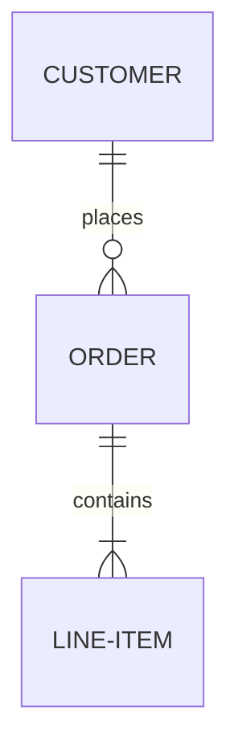
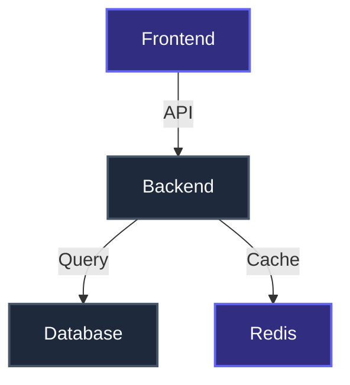

```mermaid
%%{init: {
  'theme': 'base',
  'themeVariables': {
    'primaryColor': '#F8FAFC',
    'primaryTextColor': '#334155',
    'primaryBorderColor': '#64748B',
    'lineColor': '#64748B',
    'secondaryColor': '#E2E8F0',
    'tertiaryColor': '#F1F5F9',
    'background': '#1E293B'  /* Dark background */
  }
}}%%
graph TD
    A[Client] -->|request| B[Load Balancer]
    B -->|forward| C[Server 1]
    B -->|forward| D[Server 2]
    
    classDef default fill:#F8FAFC,stroke:#64748B,stroke-width:2px,color:#334155;
    classDef highlight fill:#E2E8F0,stroke:#475569,stroke-width:2px,color:#1E293B;
    
    class A,B highlight
```

```mermaid
%%{init: {
  'theme': 'base',
  'themeVariables': {
    'primaryColor': '#312E81',
    'primaryTextColor': '#ffffff',
    'primaryBorderColor': '#6366F1',
    'lineColor': '#818CF8',
    'secondaryColor': '#4F46E5',
    'tertiaryColor': '#4338CA',
    'background': '#F5F3FF'  /* Light purple background */
  }
}}%%
sequenceDiagram
    participant U as User
    participant S as System
    participant D as Database
    
    U->>+S: Request
    S->>+D: Query
    D-->>-S: Response
    S-->>-U: Result
```

```mermaid
%%{init: {
  'theme': 'base',
  'themeVariables': {
    'primaryColor': '#ffffff',
    'primaryTextColor': '#0F172A',
    'primaryBorderColor': '#64748B',
    'lineColor': '#64748B',
    'secondaryColor': '#F1F5F9',
    'tertiaryColor': '#E2E8F0',
    'background': '#F0FDF4'  /* Light green background */
  }
}}%%
erDiagram
    CUSTOMER ||--o{ ORDER : places
    ORDER ||--|{ LINE-ITEM : contains
```

```mermaid
%%{init: {
  'theme': 'base',
  'themeVariables': {
    'primaryColor': '#ffffff',
    'primaryTextColor': '#1E293B',
    'primaryBorderColor': '#64748B',
    'lineColor': '#64748B',
    'secondaryColor': '#FEF2F2',
    'tertiaryColor': '#FEE2E2',
    'background': '#0F172A',  /* Dark blue background */
    'textColor': '#F8FAFC',
    'mainBkg': '#1E293B',
    'nodeBorder': '#475569',
    'clusterBkg': '#1E293B',
    'clusterBorder': '#475569',
    'edgeLabelBackground': '#1E293B'
  }
}}%%
graph TD
    A[Frontend] -->|API| B[Backend]
    B -->|Query| C[Database]
    B -->|Cache| D[Redis]
    
    classDef default fill:#1E293B,stroke:#475569,stroke-width:2px,color:#F8FAFC;
    classDef highlight fill:#312E81,stroke:#6366F1,stroke-width:2px,color:#F8FAFC;
    
    class A,D highlight
```
