# System Design Interview Problem: Design a URL Shortener (TinyURL)

URL shorteners like TinyURL and Bit.ly are widely used for condensing long URLs into a more manageable format. In this system design problem, we’ll cover the essential components, trade-offs, and design choices needed to create a URL shortener. This article will guide you through how a scalable URL shortener is designed and include relevant visuals to illustrate key concepts.

## Problem Statement

Design a URL shortener system where:
1. Users can input a long URL and receive a shortened URL.
2. When the shortened URL is accessed, it redirects to the original long URL.
3. The system should be highly available and scalable.

## System Requirements

### Functional Requirements
- **URL Shortening**: Users can enter a long URL and receive a unique, short URL.
- **URL Redirection**: When a user accesses the short URL, they are redirected to the original URL.
- **Analytics** (optional): Track and analyze URL usage (click counts, referrers, etc.).

### Non-Functional Requirements
- **High Availability**: The system should handle a large number of requests reliably.
- **Scalability**: The system should scale to support a high volume of users.
- **Low Latency**: Redirects should be near-instantaneous.

## Estimations and Constraints

1. **Traffic Estimation**: Assuming 500 million new URLs per month, that's about 200 URLs per second.
2. **Storage Estimation**: If each URL mapping requires 100 bytes, we’d need around 50 GB per year.
3. **Read vs. Write Ratio**: Typically, read requests (redirects) far outnumber writes (URL creations). A 100:1 read-to-write ratio is typical.

---

## Key Design Components

1. **API for URL Creation and Redirection**
2. **Database for URL Storage and Retrieval**
3. **Hashing System for Generating Short URLs**
4. **Caching Layer for Faster Redirection**

### High-Level Architecture Diagram
The following diagram illustrates the general flow of how users interact with the URL shortener system.

```mermaid
graph TD;
    style UserRequest fill:#0d1117,stroke:#00e6e6,stroke-width:2px;
    style API fill:#0d1117,stroke:#39ff14,stroke-width:2px;
    style HashingSystem fill:#0d1117,stroke:#ff073a,stroke-width:2px;
    style DB fill:#0d1117,stroke:#ffb347,stroke-width:2px;
    style CacheLayer fill:#0d1117,stroke:#ffd700,stroke-width:2px;
    style Redirect fill:#0d1117,stroke:#7df9ff,stroke-width:2px;

    UserRequest[User Request] -->|POST Long URL| API[API Server];
    API -->|Generate Short URL| HashingSystem[Hashing System];
    HashingSystem -->|Store URL Mapping| DB[Database];
    API -->|Return Short URL| UserRequest;
    UserClick[User Click on Short URL] -->|GET Short URL| API;
    API -->|Check Cache| CacheLayer[Cache];
    CacheLayer -->|Cache Hit| Redirect[Redirect to Long URL];
    CacheLayer -->|Cache Miss| DB;
    DB --> Redirect;
```



---

## 1. API Design

The system will need two primary APIs:

- **POST /create**  
  Accepts a long URL and returns a shortened URL.

- **GET /{shortenedPath}**  
  Redirects the user to the original long URL associated with the `shortenedPath`.

```python
# Pseudo-code for URL Creation API
def create_short_url(long_url):
    short_url = generate_short_url(long_url)
    save_to_db(short_url, long_url)
    return short_url

# Pseudo-code for URL Redirection API
def redirect_short_url(short_url):
    long_url = get_long_url_from_db(short_url)
    if long_url:
        return redirect_to(long_url)
    else:
        return error_page("URL not found")
```

---

## 2. Database Design

We'll need a database to store mappings between the short URLs and long URLs. A typical schema might look like:

| short_url | long_url      | created_at   | expiration |
|-----------|---------------|--------------|------------|
| xYz123    | long-url.com  | 2024-11-01   | NULL       |

- **Primary Key**: `short_url`
- **Indexes**: Adding indexes on `created_at` and `expiration` would help efficiently manage data aging and cleanup.

#### Choice of Database
- **Relational Database** (e.g., MySQL): Works well initially but can have scaling issues as data grows.
- **NoSQL Database** (e.g., DynamoDB, Cassandra): Better for high availability and scalability.

> **Tip**: For high traffic, NoSQL databases with high read/write throughput and horizontal scaling are more suitable.

---

## 3. URL Shortening (Hashing) Strategy

To generate a unique and short identifier, we can use a hashing approach, transforming the long URL into a compact, fixed-length identifier.

### Techniques for URL Hashing

1. **Base62 Encoding**
   - Converts the hashed value into a string using a 62-character alphabet (`0-9`, `a-z`, `A-Z`).
   - This provides around 57 billion unique IDs with six characters.
   
2. **MD5/SHA-256 Hashing**
   - Generate a unique hash for the URL, then use only a subset (e.g., first 6 characters).
   
3. **UUIDs**
   - Universally unique but can be overkill if shorter, URL-specific strings are sufficient.

#### Collision Handling
Two URLs could hash to the same identifier. We can handle this by:
- **Regenerating the Hash**: If a collision is detected, try hashing with different salts or using a retry mechanism.
- **Incremental Suffix**: Append a counter if a collision occurs.

```mermaid
graph TD;
    style LongURL fill:#0d1117,stroke:#ff073a,stroke-width:2px;
    style Hashing fill:#0d1117,stroke:#39ff14,stroke-width:2px;
    style Base62Encoding fill:#0d1117,stroke:#ffb347,stroke-width:2px;
    style ShortURL fill:#0d1117,stroke:#7df9ff,stroke-width:2px;

    LongURL[Long URL] --> Hashing[Hashing Function];
    Hashing --> Base62Encoding[Base62 Encoding];
    Base62Encoding --> ShortURL[Short URL];
```



---

## 4. Caching Layer

To ensure low latency, we can cache frequently accessed URLs.

- **Redis Cache**: Caches the mapping from `short_url` to `long_url`, reducing database load.
- **Cache Expiration**: Set a short TTL (time-to-live) for less popular URLs and a longer TTL for popular URLs.

#### Cache Flow

```mermaid
graph TD;
    style UserRequest fill:#0d1117,stroke:#00e6e6,stroke-width:2px;
    style CheckCache fill:#0d1117,stroke:#ff073a,stroke-width:2px;
    style Redirect fill:#0d1117,stroke:#7df9ff,stroke-width:2px;
    style FetchDB fill:#0d1117,stroke:#ffd700,stroke-width:2px;
    style UpdateCache fill:#0d1117,stroke:#39ff14,stroke-width:2px;

    UserRequest[User Request] --> CheckCache[Check Cache for short_url];
    CheckCache -->|Cache Hit| Redirect[Return Redirect];
    CheckCache -->|Cache Miss| FetchDB[Fetch from DB];
    FetchDB --> UpdateCache[Update Cache];
    UpdateCache --> Redirect;
```



---

## 5. URL Expiration

For temporary URLs, add an expiration policy:

- **Auto-Cleanup**: Remove expired URLs from the database and cache.
- **Soft Deletes**: Mark expired URLs, then periodically delete them to reduce load.

---

## 6. Load Balancing and Traffic Distribution

For high availability and scalability, use a load balancer (e.g., NGINX or AWS Elastic Load Balancing) to distribute traffic across multiple servers.

- **Vertical Scaling**: Initially increase the power of a single server.
- **Horizontal Scaling**: Distribute the load across multiple servers. Microservices architecture can help manage different parts of the service independently.

```mermaid
graph TD;
    style UserRequests fill:#0d1117,stroke:#00e6e6,stroke-width:2px;
    style LoadBalancer fill:#0d1117,stroke:#ffb347,stroke-width:2px;
    style Server1 fill:#0d1117,stroke:#39ff14,stroke-width:2px;
    style Server2 fill:#0d1117,stroke:#39ff14,stroke-width:2px;
    style Server3 fill:#0d1117,stroke:#39ff14,stroke-width:2px;

    UserRequests[User Requests] --> LoadBalancer[Load Balancer];
    LoadBalancer --> Server1[Server 1];
    LoadBalancer --> Server2[Server 2];
    LoadBalancer --> Server3[Server 3];
```



---

## Conclusion

Designing a URL shortener involves building a scalable and efficient service that stores URL mappings, handles high volumes of traffic, and ensures low-latency redirection. Through efficient hashing, caching, and load balancing, we can achieve a high-performing system that serves millions of users seamlessly.

### Summary of Key Takeaways

- **Hashing & Encoding**: Use Base62 encoding for generating compact, unique short URLs.
- **Database & Caching**: Use a distributed NoSQL database for high availability and Redis for caching.
- **Load Balancing**: Essential for scaling the service across multiple servers.

This guide covers the essentials of a URL shortener system. By understanding and applying these concepts, you'll be prepared to design a scalable, reliable URL shortener in a system design interview!
